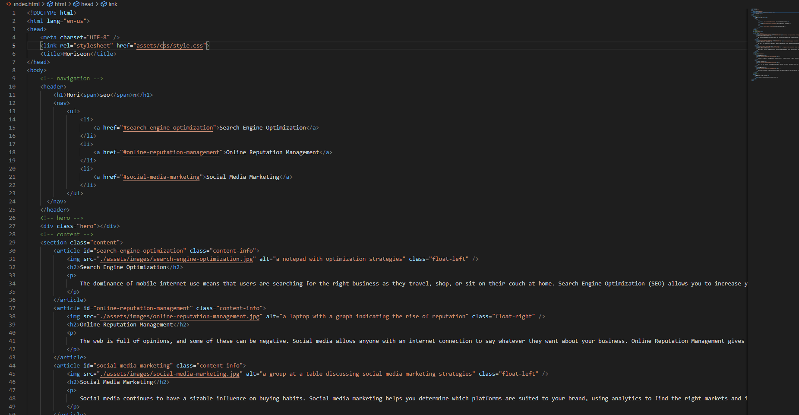

# Code Refactoring for Horiseon
## Description
In this challenge the original code for Horiseon was refactored to meet accessibilty standards as well as increase the legibilty and longevity of the code.
## Screenshots
### index.html

### style.css

## Links
https://lclark31.github.io/Horiseon-Refactor/
